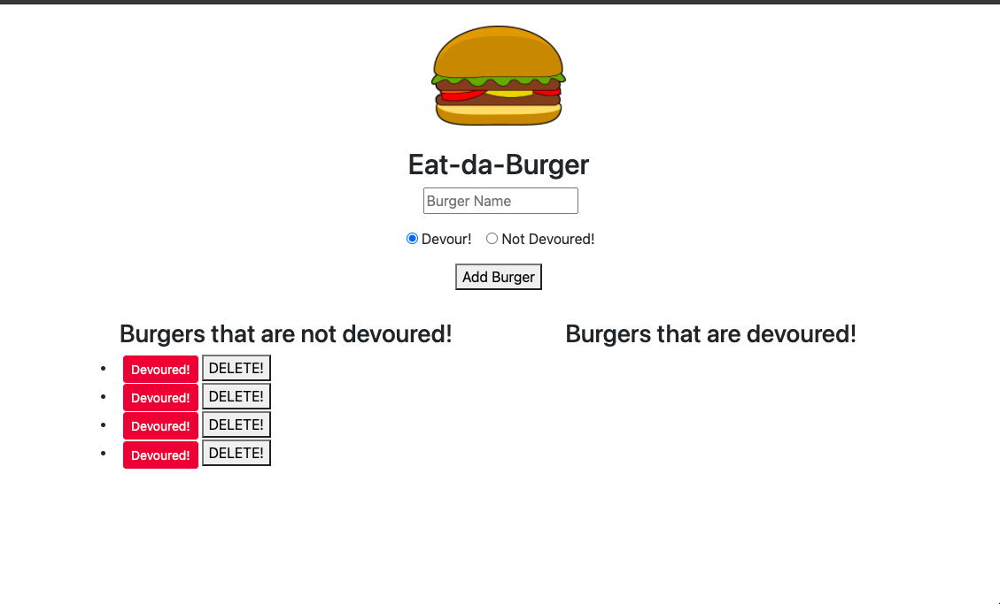

# Burger

## Table of Contents
 - [Description](#description)

 - [Deployed Link](#deployed-link)

 - [Installation](#installation)

 - [Repository](#Repository)

 - [License](#license)

 - [TechnonlogyUse](#Technonlogy-Use)

 - [Question](#Question)

## Description

  This application allows users to add burgers to a list of Devoured or Not Devoured. Users can also change the status of a burger from Devoured to Not Devoured, and vice versa.

  

## Deployed Link

 [Deployed-Heroku-Link]()

 [Deployed-Heroku-Link]()

## Installation
 * npm init 
 * npm install express
 * npm install express-handlebars
 * npm install mysql

 ## Repository

 * Run the following command at the terminal for your answer.

 * node server.js

## Technonlogy Use

 * NODE
 *  MYSQL
 * Experss
 * Handlebars
 * Orm
 * Heroku Deploed
 

## License

 

## Question
  
 * [Email](abuye20@yahoo.com)

 * [LinkedIn](https://www.linkedin.com/in/abuye-mamuye-5a49921b0/)

 * [GitHub](https://github.com/AbuyeM1/Burger)

## Acknowledgments
 - Jerome Chenette (Instructor)
 - Manuel Nunes (TA)
 - Mahisha Manikandan (TA)
 - UC Berkeley Coding Bootcamp

